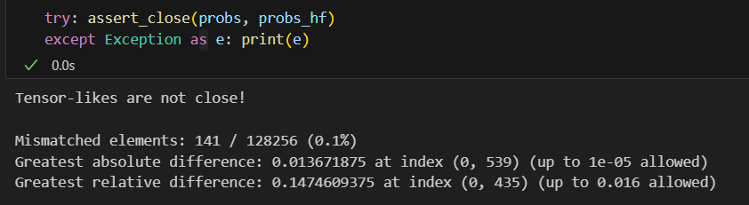
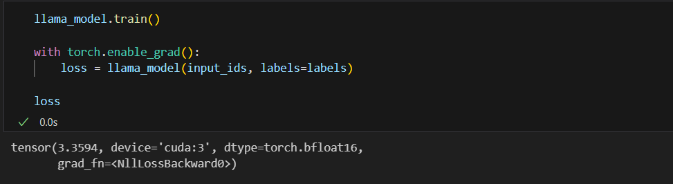
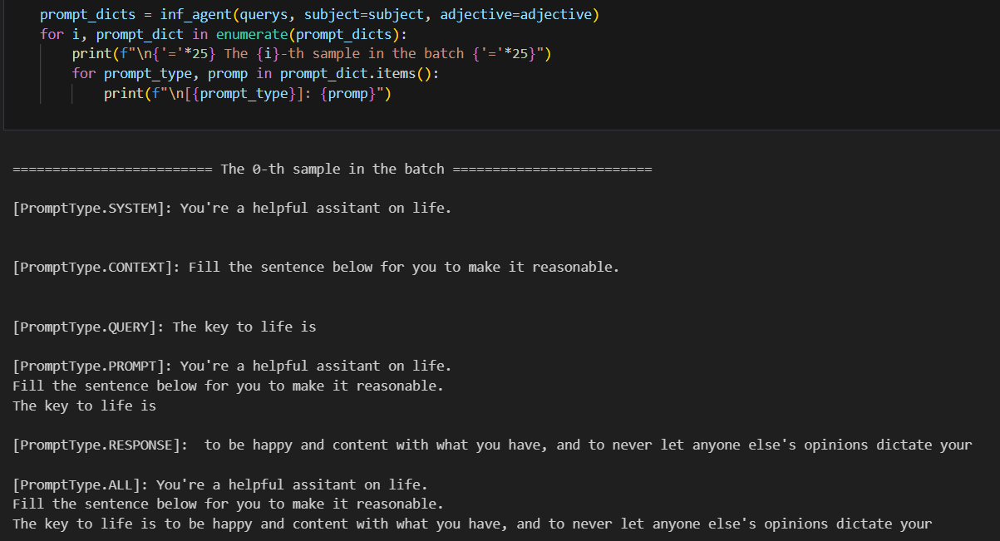
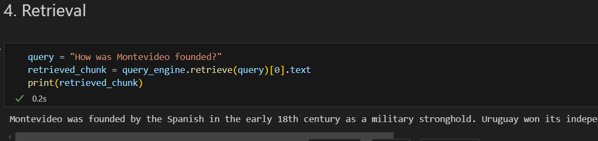

<div align="center" style="font-size: 25px;">
  智能应用开发 Assignment 5 实验报告
</div>
<div align="center" style="font-size: 15px;">
  221220003 林涵坤 linhk@smail.nju.edu.cn
</div>

### Task 1

**基本任务**

调用了 Assignment 1 至 Assignment 4 里实现的所有接口，同时实现了 `./src/modeling/models/llama.py` 中的 `LlamaModel` 类。需要考虑的点在于加载模型配置文件 `config.json` 和参数 `model.safetensors` 时名称映射的处理（例如 `model.layer.0.self_attn.o_proj` 的形状虽然是 `[2048, 2048]`，但也要做转置才与自己模型中 `o_proj` 应有的参数相匹配，这个点 debug 了好久...）

在提供的 `./test_toy_task1.ipynb` 上使用从 NJUBox 下载的 **llama_3.2_1b_instruct**（`./model/llama_3.2_1b_instruct`） 进行测试，结果如下：





可以看到无论是训练还是推理模式下，我实现的 `LlamaModel` 的输出均与 Huggingface 实现的输出相差很小（Huggingface 训练模式下的 loss 是 3.3701）

**Bonus**

未尝试

### Task 2

**基本任务**

实现了 `./src/modeling/prompt.py` 中的 `PromptTemplate` 类以及 `./src/inference/agent.py` 中的 `InferenceAgent` 类。 `task2.md` 中给出的处理逻辑已经非常详细了，只需要原封不动照搬即可。最终在提供的 `./test_toy_task2.ipynb` 上基于 Task1 的 `LlamaModel` 进行文本生成推理任务的测试，结果如下（以第 1 个样例为例）：



可以看到模型正确地对给定的提示词进行了很有逻辑的补全，并且与用 Transformers 的 Pipeline 构建的智能体的输出非常类似（截图中未给出，可以在 notebook 里找到），证明了 InferenceAgent 成功构建。

**Bonus**

基于 [LlamaIndex](https://docs.llamaindex.ai/en/stable/#getting-started) 构建了一个可以进行 RAG 的智能回答机器人，从而为 LLM 引入信息的时效性，增强 LLM 的可解释性，消除 LLM 的幻觉。

LlamaIndex 的安装方式如下：

```
pip install llama-index
```

这里为了演示方便，仅使用了一个轻量级检索数据集 [Mini-wikipedia](https://huggingface.co/datasets/rag-datasets/rag-mini-wikipedia)，你可以将其替换成任何你喜欢的检索源或知识库。其下载可以通过以下 python 代码完成，下载完成后应位于 `./data/RAG/mini-wikipedia`：

```
from datasets import load_dataset
ds = load_dataset("rag-datasets/rag-mini-wikipedia", "text-corpus", cache_dir='./data/RAG')
```

RAG 的 Embedding Model 使用 [bge-large-en-v1.5](https://huggingface.co/BAAI/bge-large-en-v1.5)，其下载也可以通过以下 python 代码完成，下载完成后应位于 `./model/bge-large-en-v1.5`：

```
from transformers import AutoTokenizer, AutoModel
tokenizer = AutoTokenizer.from_pretrained('BAAI/bge-large-en-v1.5', cache_dir='./model')
model = AutoModel.from_pretrained('BAAI/bge-large-en-v1.5', cache_dir='./model')
```

整个流程的代码与输出展示可以在 `./task2_bonus_demo.ipynb` 中找到，这里仅做一个简短的介绍。首先，对于给定的用户问题，借助 Llama-Index 从 Mini-wikipedia 中检索出与之最相关的文本块：



接着，在智能问答机器人的生成过程中，我精心设计了系统提示词，在里面给出了模型需要完成的任务（判断检索出的信息是否有用，再基于该信息回答问题）：

```
system_prompt_template = PromptTemplate(
    template_str="You're a helpful assitant on {subject}. You will be given a question and a corresponding paragraph that might be useful in answering the question. You should first decide whether the information is helpful, then give your final answer to the question based on the information if it is indeed useful (or otherwise, just answer based on your own knowledge).\n",
)
```

上下文提示词则直接用之前检索到的文本块进行替代：

```
context_prompt_template = PromptTemplate(
    template_str="Information that might be useful: {information}.\n",
)
```

最后，InferenceAgent 的输出如下：

```
========================= The 0-th sample in the batch =========================

[PromptType.SYSTEM]: You're a helpful assitant on Question Anwering. You will be given a question and a corresponding paragraph that might be useful in answering the question. You should first decide whether the information is indeed helpful, then give your final answer to the question based on the information if it is useful (or otherwise, just answer based on your own knowledge).


[PromptType.CONTEXT]: Information that might be useful: Montevideo was founded by the Spanish in the early 18th century as a military stronghold. Uruguay won its independence in 1828 following a three-way struggle between Spain, Argentina and Brazil. It is a constitutional democracy, where the president fulfills the roles of both head of state and head of government.


[PromptType.QUERY]: How was Montevideo founded?

[PromptType.PROMPT]: You're a helpful assitant on Question Anwering. You will be given a question and a corresponding paragraph that might be useful in answering the question. You should first decide whether the information is indeed helpful, then give your final answer to the question based on the information if it is useful (or otherwise, just answer based on your own knowledge).
Information that might be useful: Montevideo was founded by the Spanish in the early 18th century as a military stronghold. Uruguay won its independence in 1828 following a three-way struggle between Spain, Argentina and Brazil. It is a constitutional democracy, where the president fulfills the roles of both head of state and head of government.
How was Montevideo founded?

[PromptType.RESPONSE]:  
Montevideo was founded by the Spanish in the early 18th century as a military stronghold. The city was strategically located on the Río de la Plata, which provided access to the Atlantic Ocean and facilitated trade and commerce. The Spanish established the city as a fortified settlement, with the goal of controlling the region and protecting their interests. Over time, the city grew and developed into a major commercial center, with a diverse economy based on agriculture, livestock, and trade. The city's
```

可以看到，引入 RAG 之后，智能回答机器人可以根据我们为它挂载的知识库中的信息，更新自己的回答。

### Task 3

**基本任务**

首先，实现了 `./src/modeling/datasets/qa.py`中的 `QADataset` 类 与 `./src/modeling/datasets/chat.py` 中的 `ChatDataset`类，并测试了相关成员函数的功能，结果与 `Ref` 实现一致（可以在 `./test_toy_task3.ipynb` 中找到我的输出，与 notebook 最开始自带的 `Ref` 的输出比较发现二者完全相同）需要注意的是对 padding 和 truncation 的处理。

然后，又实现了 `./src/training/base.py` 中的 `BaseTrainer` 类与 `./src/training/lora.py` 中的 `LoRATrainer` 类，同样是基于 `task3.md` 里给出的逻辑，整体没有过多的思维含量。使用构建好的 `LoRATrainer` 在之前的 `QADataset` 上进行 10 个 steps 的训练，发现 loss 从 14.0625 下降到 10，同时也在 `ChatDataset` 上进行 10 个 steps 的训练，loss 从 13.6875 下降到 9.375，（以上结果可以在 `./test_toy_task3.ipynb` 中找到），从而印证了对 `LoRATrainer` 类的正确实现。

**Bonus**

未尝试